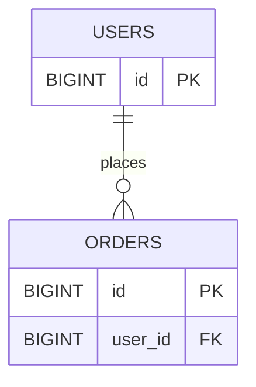

# Resource Modeling and Naming

## Why it matters
Good resource models make APIs intuitive and consistent across teams.

## Progression checkpoints
| Level | Focus |
| --- | --- |
| Beginner | Map entities to resources. |
| Intermediate | Design hierarchical relationships. |
| Senior | Avoid deep nesting and ambiguous names. |
| Principal | Define org-wide naming standards. |

## Key concepts
- Resource nouns vs action verbs.
- Hierarchical URLs and ownership.
- Pluralization and consistency.
- Avoiding overly nested routes.

## Detailed explanation
- **Resource nouns** keep APIs predictable. Use verbs only for actions that
  cannot be modeled as state changes.
- **Hierarchies** express ownership (users/{id}/orders) but should not be
  overly deep or dependent on join-heavy paths.
- **Consistency** in naming and pluralization reduces client confusion.
- **Shallow nesting** keeps routes stable even if internal relationships change.

## Real-world example: Orders API
Orders belong to users but should be queried independently for admin tools.

```
GET /users/{id}/orders
GET /orders/{order_id}
```

## Diagram


## Additional real-world examples
- `POST /orders/{id}:cancel` used for non-CRUD state transitions.
- Admin tools use `/orders` to search without a user context.
- `/users/{id}/billing-address` exposed as a subresource for clear ownership.

## Practical checklist
- Prefer nouns for resources.
- Keep nesting to two levels max.
- Document ownership and relationships.

## Official documentation
- https://cloud.google.com/apis/design/resources
- https://github.com/microsoft/api-guidelines
