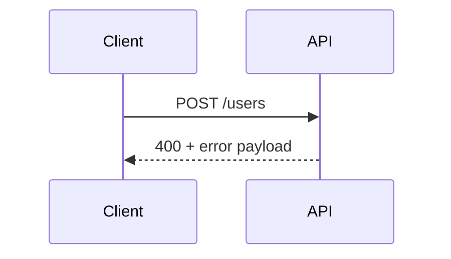

# Requests, Responses, and Errors

## Why it matters
Predictable responses reduce client bugs and speed up integration.

## Progression checkpoints
| Level | Focus |
| --- | --- |
| Beginner | Use correct status codes. |
| Intermediate | Define consistent error formats. |
| Senior | Standardize validation and edge cases. |
| Principal | Enforce response contracts across teams. |

## Key concepts
- HTTP status codes: 2xx, 4xx, 5xx.
- Error schemas and error codes.
- Validation error details.
- Partial success and batch behavior.

## Detailed explanation
- **Status codes** should be consistent and predictable across endpoints.
- **Error schemas** provide machine-readable codes plus human-readable messages.
- **Validation details** help clients fix input without guesswork.
- **Batch responses** must define partial success behavior and per-item errors.

## Real-world example: Validation error
A signup API returns field-level validation errors.

```json
{
  "error": {
    "code": "VALIDATION_ERROR",
    "message": "Invalid input",
    "details": {
      "email": "must be a valid address"
    }
  }
}
```

## Diagram


## Additional real-world examples
- Bulk update returns `207 Multi-Status` with per-item outcomes.
- Rate limit errors include a `Retry-After` header and standardized code.
- 404 vs 403 used carefully to avoid leaking resource existence.

## Practical checklist
- Use 400 for validation errors, 404 for missing resources.
- Include machine-readable error codes.
- Avoid leaking internal stack traces.

## Official documentation
- https://www.rfc-editor.org/rfc/rfc9457
- https://www.rfc-editor.org/rfc/rfc9110
