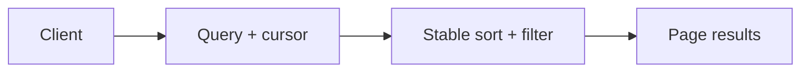

# Pagination, Filtering, Sorting

## Why it matters
Large datasets require consistent pagination and filtering to avoid slow
queries and unstable results.

## Progression checkpoints
| Level | Focus |
| --- | --- |
| Beginner | Use basic pagination parameters. |
| Intermediate | Implement stable sorting and filtering. |
| Senior | Use cursor-based pagination at scale. |
| Principal | Set org-wide list and filter standards. |

## Key concepts
- Offset vs cursor pagination.
- Filter syntax and allow-lists.
- Stable sorting with tie-breakers.
- Sparse fieldsets to reduce payload size.

## Detailed explanation
- **Cursor pagination** scales better by using stable sort keys instead of
  offsets that become slower over time.
- **Filter allow-lists** prevent expensive or unsafe filters from hitting the DB.
- **Stable sorting** with tie-breakers avoids duplicate or missing items when
  paging.
- **Sparse fieldsets** reduce payload size for mobile or list-heavy UIs.

## Real-world example: Orders list
A dashboard uses cursor pagination and filters by status.

```
GET /orders?status=paid&limit=50&cursor=2024-01-10T10:12:00Z
```

## Diagram


## Additional real-world examples
- `Link` headers include `next` and `prev` URLs for pagination.
- Sorting uses `created_at, id` to keep ordering stable during inserts.
- Filter allow-list blocks unindexed fields to avoid full scans.

## Practical checklist
- Use stable ordering for pagination.
- Validate filter fields server-side.
- Keep default limits conservative.

## Official documentation
- https://www.rfc-editor.org/rfc/rfc8288
- https://cloud.google.com/apis/design/design_patterns#list_pagination
