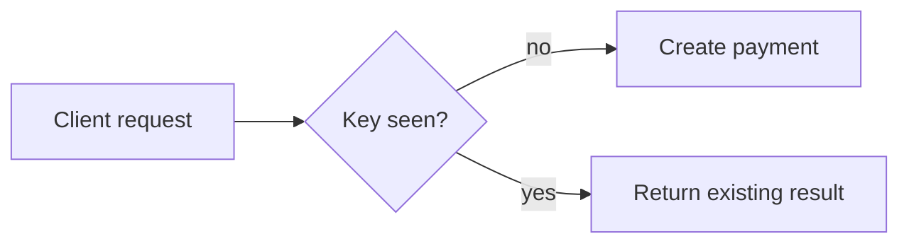

# Idempotency and Retries

## Why it matters
Retries are essential for reliability. Idempotency prevents double charges and
duplicate writes.

## Progression checkpoints
| Level | Focus |
| --- | --- |
| Beginner | Understand safe vs unsafe methods. |
| Intermediate | Use idempotency keys for POST. |
| Senior | Define retry budgets and error classes. |
| Principal | Standardize retry and idempotency policies. |

## Key concepts
- Idempotent methods and semantics.
- Idempotency keys for write requests.
- Retryable vs non-retryable errors.
- Deduplication windows.

## Detailed explanation
- **Idempotent methods** (GET, PUT, DELETE) should be safe to retry without
  changing server state multiple times.
- **Idempotency keys** allow POST requests to be retried safely by returning
  the original result for duplicate keys.
- **Retryable errors** are typically network failures or 5xx responses;
  avoid retrying 4xx unless explicitly documented.
- **Deduplication windows** should match client retry behavior and retention.

## Real-world example: Payment creation
A client retries a payment request with the same idempotency key.

```http
POST /payments
Idempotency-Key: pay-9c1d
```

## Diagram


## Additional real-world examples
- Inventory reservation API uses idempotency keys to prevent double holds.
- Client retries on 503 with jitter but stops after a budgeted deadline.
- Idempotency key stored with request hash to detect mismatched payloads.

## Practical checklist
- Store idempotency keys with expiry.
- Retry only on network errors and 5xx.
- Document retryable error codes.

## Official documentation
- https://www.rfc-editor.org/rfc/rfc9110
