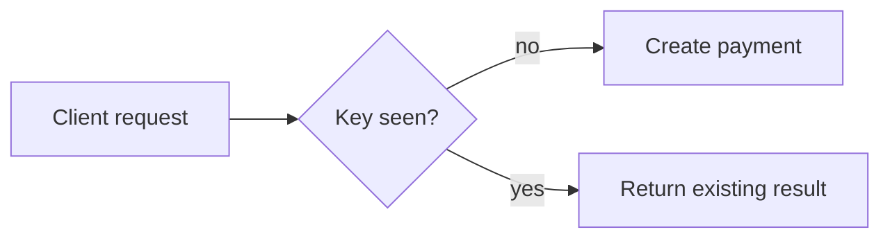

# Idempotency and Retries

## Why it matters
Retries are essential for reliability. Idempotency prevents double charges and
duplicate writes.

## Progression checkpoints
| Level | Focus |
| --- | --- |
| Beginner | Understand safe vs unsafe methods. |
| Intermediate | Use idempotency keys for POST. |
| Senior | Define retry budgets and error classes. |
| Principal | Standardize retry and idempotency policies. |

## Key concepts
- Idempotent methods and semantics.
- Idempotency keys for write requests.
- Retryable vs non-retryable errors.
- Deduplication windows.

## Real-world example: Payment creation
A client retries a payment request with the same idempotency key.

```http
POST /payments
Idempotency-Key: pay-9c1d
```

## Diagram


## Practical checklist
- Store idempotency keys with expiry.
- Retry only on network errors and 5xx.
- Document retryable error codes.
