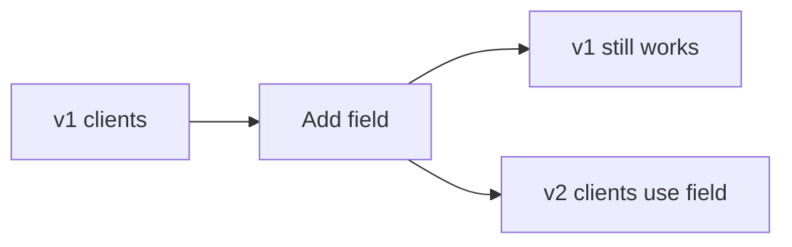

# Versioning and Compatibility

## Why it matters
APIs live longer than clients. Versioning avoids breaking changes and keeps
integrations stable.

## Progression checkpoints
| Level | Focus |
| --- | --- |
| Beginner | Understand backward compatible changes. |
| Intermediate | Use versioning strategies safely. |
| Senior | Plan deprecations and migrations. |
| Principal | Define org-wide compatibility policies. |

## Key concepts
- Backward vs forward compatibility.
- URL vs header-based versioning.
- Deprecation windows and communication.
- Additive changes and safe defaults.

## Real-world example: Add optional field
Add `middle_name` as an optional field without breaking clients.

## Diagram

## Practical checklist
- Prefer additive changes.
- Avoid renaming or changing field meaning.
- Publish deprecation timelines early.
