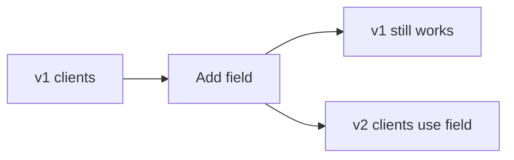

# Versioning and Compatibility

## Why it matters
APIs live longer than clients. Versioning avoids breaking changes and keeps
integrations stable.

## Progression checkpoints
| Level | Focus |
| --- | --- |
| Beginner | Understand backward compatible changes. |
| Intermediate | Use versioning strategies safely. |
| Senior | Plan deprecations and migrations. |
| Principal | Define org-wide compatibility policies. |

## Key concepts
- Backward vs forward compatibility.
- URL vs header-based versioning.
- Deprecation windows and communication.
- Additive changes and safe defaults.

## Detailed explanation
- **Backward compatibility** keeps old clients working; **forward compatibility**
  avoids breaking when new fields appear.
- **Versioning strategies** include URL paths, headers, or content negotiation.
- **Deprecation windows** give clients time to migrate and reduce support load.
- **Additive changes** (new fields) are safer than renames or behavioral changes.

## Real-world example: Add optional field
Add `middle_name` as an optional field without breaking clients.

## Diagram

## Additional real-world examples
- New enum value added with a safe default for older clients.
- Deprecated endpoint returns `Sunset` and `Deprecation` headers.
- Versioned docs publish migration guides and sample payloads.

## Practical checklist
- Prefer additive changes.
- Avoid renaming or changing field meaning.
- Publish deprecation timelines early.

## Official documentation
- https://datatracker.ietf.org/doc/html/draft-ietf-httpapi-deprecation-header
- https://cloud.google.com/apis/design/versioning
