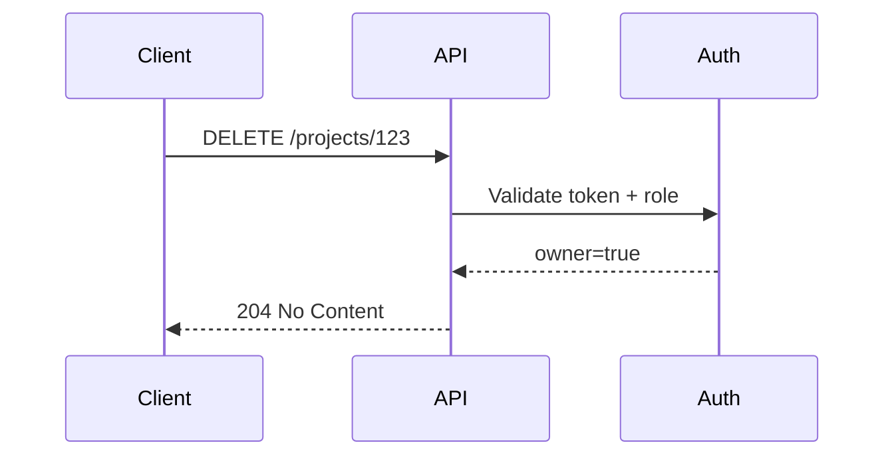

# AuthN/AuthZ Integration

## Why it matters
APIs must ensure only authorized users can access or modify data.

## Progression checkpoints
| Level | Focus |
| --- | --- |
| Beginner | Understand authentication vs authorization. |
| Intermediate | Use JWTs or sessions safely. |
| Senior | Design role-based or attribute-based access. |
| Principal | Standardize auth integration across services. |

## Key concepts
- Authentication (who you are) vs authorization (what you can do).
- Sessions, JWTs, and token validation.
- RBAC and ABAC models.
- Service-to-service auth (mTLS, tokens).

## Detailed explanation
- **Authentication** verifies identity; **authorization** checks permissions.
- **JWTs** reduce lookup calls but require validation of signature, issuer,
  audience, and expiration.
- **RBAC** is simpler; **ABAC** is more flexible for fine-grained policies.
- **Service-to-service auth** can use mTLS or short-lived tokens to reduce
  credential leakage.

## Real-world example: Project access
Only project owners can delete a project.

## Additional real-world examples
- Token exchange service issues short-lived tokens for internal APIs.
- Admin endpoints require both role and feature-flag checks.
- API logs authorization failures with reason codes for auditing.

## Practical checklist
- Validate tokens on every request.
- Keep authorization logic close to data access.
- Log access denials for auditing.

## Official documentation
- https://www.rfc-editor.org/rfc/rfc6749
- https://openid.net/specs/openid-connect-core-1_0.html
- https://www.rfc-editor.org/rfc/rfc7519
