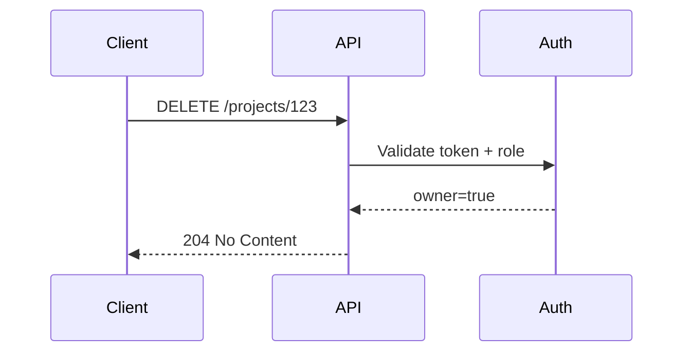

# AuthN/AuthZ Integration

## Why it matters
APIs must ensure only authorized users can access or modify data.

## Progression checkpoints
| Level | Focus |
| --- | --- |
| Beginner | Understand authentication vs authorization. |
| Intermediate | Use JWTs or sessions safely. |
| Senior | Design role-based or attribute-based access. |
| Principal | Standardize auth integration across services. |

## Key concepts
- Authentication (who you are) vs authorization (what you can do).
- Sessions, JWTs, and token validation.
- RBAC and ABAC models.
- Service-to-service auth (mTLS, tokens).

## Real-world example: Project access
Only project owners can delete a project.

## Practical checklist
- Validate tokens on every request.
- Keep authorization logic close to data access.
- Log access denials for auditing.
