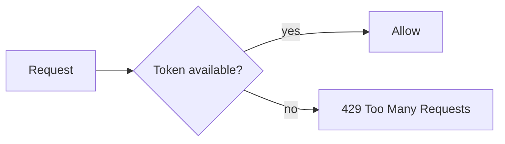

# Rate Limiting and Quotas

## Why it matters
Rate limits protect services from abuse and ensure fair usage.

## Progression checkpoints
| Level | Focus |
| --- | --- |
| Beginner | Apply basic per-IP limits. |
| Intermediate | Use user-level quotas and bursts. |
| Senior | Design global rate limits across services. |
| Principal | Define policy and enforcement standards. |

## Key concepts
- Token bucket and leaky bucket algorithms.
- Per-IP, per-user, and per-tenant limits.
- Quotas and billing tiers.
- Rate limit headers and client feedback.

## Real-world example: API tiers
Free tier users get 100 requests/minute; paid users get 1000 requests/minute.

## Diagram

## Practical checklist
- Return retry-after headers.
- Use distributed rate limiting for multi-node services.
- Monitor limit breaches and adjust tiers.
