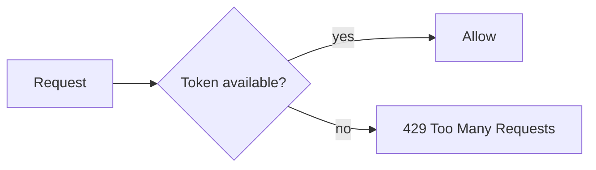

# Rate Limiting and Quotas

## Why it matters
Rate limits protect services from abuse and ensure fair usage.

## Progression checkpoints
| Level | Focus |
| --- | --- |
| Beginner | Apply basic per-IP limits. |
| Intermediate | Use user-level quotas and bursts. |
| Senior | Design global rate limits across services. |
| Principal | Define policy and enforcement standards. |

## Key concepts
- Token bucket and leaky bucket algorithms.
- Per-IP, per-user, and per-tenant limits.
- Quotas and billing tiers.
- Rate limit headers and client feedback.

## Detailed explanation
- **Token bucket** allows short bursts while enforcing an average rate.
- **Per-tenant limits** prevent noisy neighbors from starving shared capacity.
- **Quotas** align usage with billing tiers and cost controls.
- **Headers** like `Retry-After` give clients actionable guidance.

## Real-world example: API tiers
Free tier users get 100 requests/minute; paid users get 1000 requests/minute.

## Diagram

## Additional real-world examples
- Burst limits applied to login endpoints to reduce credential stuffing.
- Partner APIs get higher quotas with separate limit buckets.
- Global rate limiter stored in Redis to coordinate multiple instances.

## Practical checklist
- Return retry-after headers.
- Use distributed rate limiting for multi-node services.
- Monitor limit breaches and adjust tiers.

## Official documentation
- https://www.rfc-editor.org/rfc/rfc6585
- https://www.rfc-editor.org/rfc/rfc9110
