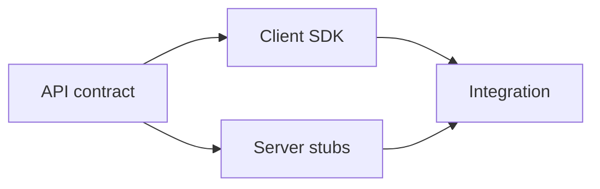

# Contracts: OpenAPI and gRPC

## Why it matters
API contracts enable validation, client generation, and compatibility checks.

## Progression checkpoints
| Level | Focus |
| --- | --- |
| Beginner | Read OpenAPI specs and basic schemas. |
| Intermediate | Generate clients and validate requests. |
| Senior | Use protobuf and schema evolution rules. |
| Principal | Enforce contract-first development. |

## Key concepts
- OpenAPI/Swagger and JSON Schema.
- Contract-first vs code-first workflows.
- gRPC and protobuf definitions.
- Compatibility rules for schema changes.

## Detailed explanation
- **OpenAPI** defines HTTP contracts for validation, documentation, and SDKs.
- **JSON Schema** describes payload shapes and required fields.
- **gRPC + protobuf** provide strongly typed contracts and code generation.
- **Compatibility rules** avoid breaking changes when fields or enums evolve.

## Real-world example: OpenAPI endpoint
Define a simple user endpoint in OpenAPI.

```yaml
paths:
  /users/{id}:
    get:
      responses:
        "200":
          description: User
```

## Diagram


## Additional real-world examples
- CI validates new OpenAPI changes against a compatibility checker.
- Protobuf fields are only added, never renumbered or reused.
- Mock servers generated from OpenAPI to unblock frontend work.

## Practical checklist
- Treat contracts as source of truth.
- Validate requests/responses against schemas.
- Document compatibility and versioning rules.

## Official documentation
- https://spec.openapis.org/oas/latest.html
- https://json-schema.org/specification.html
- https://grpc.io/docs/
- https://protobuf.dev/programming-guides/proto3/
