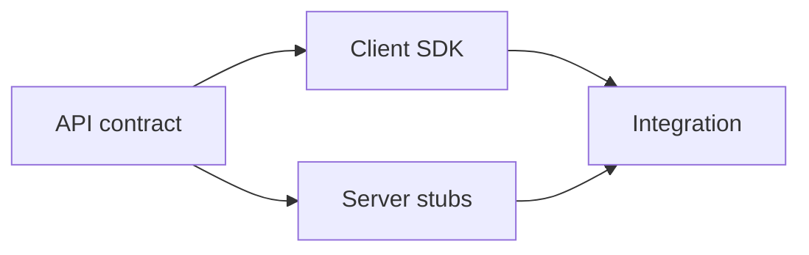

# Contracts: OpenAPI and gRPC

## Why it matters
API contracts enable validation, client generation, and compatibility checks.

## Progression checkpoints
| Level | Focus |
| --- | --- |
| Beginner | Read OpenAPI specs and basic schemas. |
| Intermediate | Generate clients and validate requests. |
| Senior | Use protobuf and schema evolution rules. |
| Principal | Enforce contract-first development. |

## Key concepts
- OpenAPI/Swagger and JSON Schema.
- Contract-first vs code-first workflows.
- gRPC and protobuf definitions.
- Compatibility rules for schema changes.

## Real-world example: OpenAPI endpoint
Define a simple user endpoint in OpenAPI.

```yaml
paths:
  /users/{id}:
    get:
      responses:
        "200":
          description: User
```

## Diagram


## Practical checklist
- Treat contracts as source of truth.
- Validate requests/responses against schemas.
- Document compatibility and versioning rules.
