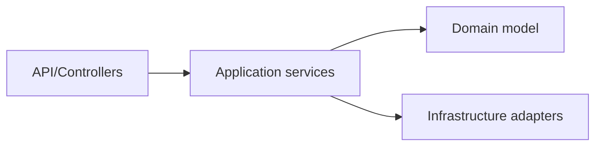

# Layered and Clean Architecture

## Why it matters
Layering reduces coupling and improves testability.

## Progression checkpoints
| Level | Focus |
| --- | --- |
| Beginner | Understand controllers, services, repositories. |
| Intermediate | Apply clean or hexagonal architecture. |
| Senior | Isolate domain logic from infrastructure. |
| Principal | Standardize architecture templates. |

## Key concepts
- Presentation, application, domain, infrastructure layers.
- Dependency rule: inward dependencies only.
- Ports and adapters.

## Detailed explanation
- **Layering** organizes code by responsibility and reduces cross-cutting
  coupling.
- **Inward dependencies** keep domain logic independent from frameworks and I/O.
- **Ports and adapters** allow swapping infrastructure (DB, queues) without
  changing core business logic.

## Real-world example: Order service
Business rules live in a domain layer and can be tested without databases.

## Diagram

## Additional real-world examples
- Domain layer tested without databases by swapping in-memory adapters.
- Infrastructure layer replaced from REST client to gRPC with no domain changes.
- Controllers are thin and only handle request/response mapping.

## Practical checklist
- Keep domain logic free of framework dependencies.
- Define clear interfaces between layers.
- Enforce boundary rules in code review.

## Official documentation
- https://learn.microsoft.com/en-us/azure/architecture/guide/architecture-styles/n-tier
- https://aws.amazon.com/architecture/
