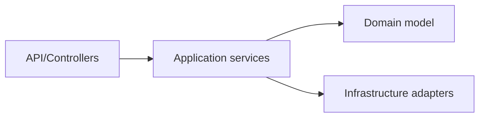

# Layered and Clean Architecture

## Why it matters
Layering reduces coupling and improves testability.

## Progression checkpoints
| Level | Focus |
| --- | --- |
| Beginner | Understand controllers, services, repositories. |
| Intermediate | Apply clean or hexagonal architecture. |
| Senior | Isolate domain logic from infrastructure. |
| Principal | Standardize architecture templates. |

## Key concepts
- Presentation, application, domain, infrastructure layers.
- Dependency rule: inward dependencies only.
- Ports and adapters.

## Real-world example: Order service
Business rules live in a domain layer and can be tested without databases.

## Diagram

## Practical checklist
- Keep domain logic free of framework dependencies.
- Define clear interfaces between layers.
- Enforce boundary rules in code review.
