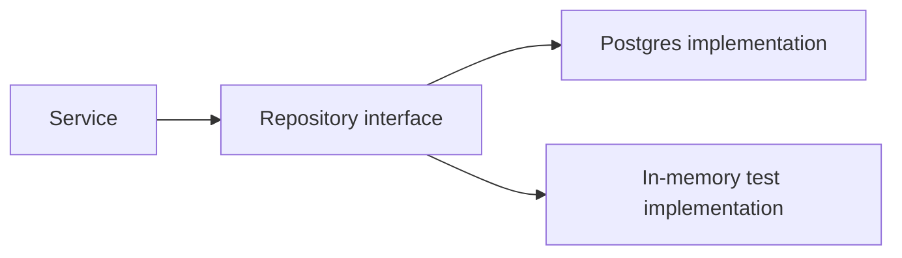

# Dependency Inversion and DI

## Why it matters
Dependency inversion decouples modules and makes testing easier.

## Progression checkpoints
| Level | Focus |
| --- | --- |
| Beginner | Understand interfaces and abstractions. |
| Intermediate | Use constructor injection. |
| Senior | Avoid service locator anti-patterns. |
| Principal | Define DI standards for teams. |

## Key concepts
- Dependency inversion principle.
- Constructor vs setter injection.
- Mocking dependencies in tests.

## Real-world example: Repository abstraction
The service depends on a repository interface, not a specific database.

## Diagram

## Practical checklist
- Inject dependencies explicitly.
- Avoid global singletons for core services.
- Use interfaces for external systems.
