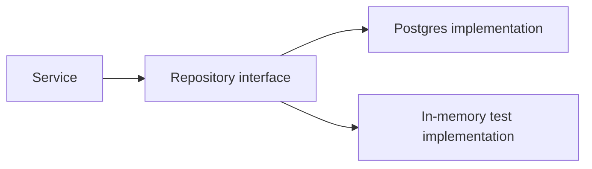

# Dependency Inversion and DI

## Why it matters
Dependency inversion decouples modules and makes testing easier.

## Progression checkpoints
| Level | Focus |
| --- | --- |
| Beginner | Understand interfaces and abstractions. |
| Intermediate | Use constructor injection. |
| Senior | Avoid service locator anti-patterns. |
| Principal | Define DI standards for teams. |

## Key concepts
- Dependency inversion principle.
- Constructor vs setter injection.
- Mocking dependencies in tests.

## Detailed explanation
- **Dependency inversion** means high-level policies depend on abstractions,
  not concrete implementations.
- **Constructor injection** makes dependencies explicit and easier to test.
- **Service locator** hides dependencies and complicates testing and refactors.
- **Mocking** enables deterministic tests without external systems.

## Real-world example: Repository abstraction
The service depends on a repository interface, not a specific database.

## Diagram

## Additional real-world examples
- Payment service swaps a fake gateway in tests via DI.
- Feature flag client injected per environment instead of using globals.
- Batch job uses a mock clock for deterministic time-based tests.

## Practical checklist
- Inject dependencies explicitly.
- Avoid global singletons for core services.
- Use interfaces for external systems.

## Official documentation
- https://learn.microsoft.com/en-us/dotnet/core/extensions/dependency-injection
- https://docs.spring.io/spring-framework/reference/core/beans.html
