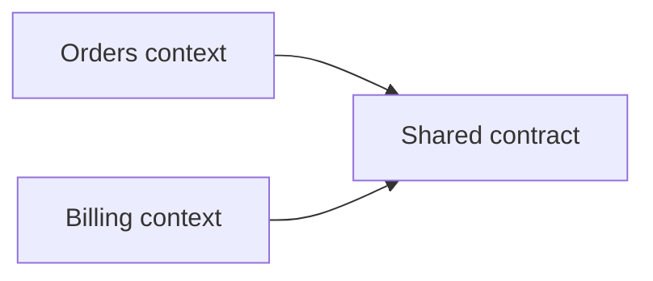

# Domain-Driven Design

## Why it matters
DDD helps align software models with business domains and reduces ambiguity.

## Progression checkpoints
| Level | Focus |
| --- | --- |
| Beginner | Identify entities and aggregates. |
| Intermediate | Define bounded contexts. |
| Senior | Design contracts between contexts. |
| Principal | Align org boundaries with domain boundaries. |

## Key concepts
- Ubiquitous language.
- Entities, value objects, aggregates.
- Bounded contexts and context maps.

## Detailed explanation
- **Ubiquitous language** reduces ambiguity by aligning technical and business
  terms across teams.
- **Aggregates** define consistency boundaries; only the aggregate root is
  mutated directly.
- **Bounded contexts** allow different models for different domains without
  forcing a single universal schema.

## Real-world example: Commerce domains
Orders and Billing use separate models to avoid coupling.

## Diagram

## Additional real-world examples
- Shipping uses a different "Order" model than Billing to avoid coupling.
- A shared contract maps only the fields needed for cross-context integrations.
- Context map documents upstream/downstream ownership.

## Practical checklist
- Use a shared vocabulary with stakeholders.
- Keep aggregates small and consistent.
- Avoid cross-context direct database access.

## Official documentation
- https://learn.microsoft.com/en-us/azure/architecture/guide/domain-driven-design/
