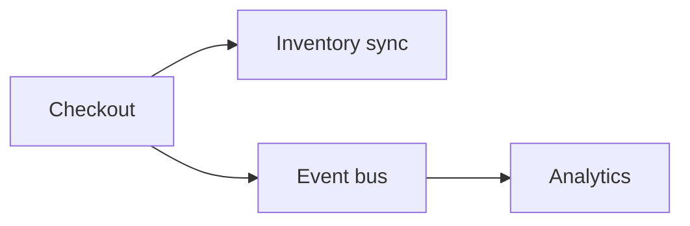

# Integration Patterns

## Why it matters
Services must communicate reliably. The integration style affects latency,
consistency, and failure modes.

## Progression checkpoints
| Level | Focus |
| --- | --- |
| Beginner | Understand sync vs async calls. |
| Intermediate | Use queues for decoupling. |
| Senior | Choose patterns based on reliability needs. |
| Principal | Define integration standards across services. |

## Key concepts
- Synchronous RPC vs asynchronous messaging.
- Request/response vs event-driven.
- Timeouts, retries, and circuit breakers.

## Detailed explanation
- **Synchronous RPC** is simple but couples availability; timeouts and retries
  must be carefully tuned.
- **Asynchronous messaging** decouples services and absorbs spikes but adds
  eventual consistency.
- **Circuit breakers** prevent cascading failures when downstreams are unstable.

## Real-world example: Inventory updates
Checkout calls inventory synchronously for availability, then publishes an
async event for analytics.

## Diagram

## Additional real-world examples
- Email notifications sent asynchronously to avoid slowing checkout.
- Webhook delivery uses retry + backoff with a dead-letter queue.
- Analytics events buffered during outages and replayed later.

## Practical checklist
- Use async for non-critical side effects.
- Keep sync calls short and bounded.
- Document failure modes per integration.

## Official documentation
- https://aws.amazon.com/event-driven-architecture/
- https://cloud.google.com/pubsub/docs/overview
