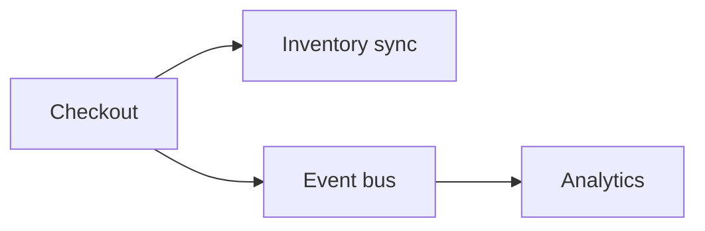

# Integration Patterns

## Why it matters
Services must communicate reliably. The integration style affects latency,
consistency, and failure modes.

## Progression checkpoints
| Level | Focus |
| --- | --- |
| Beginner | Understand sync vs async calls. |
| Intermediate | Use queues for decoupling. |
| Senior | Choose patterns based on reliability needs. |
| Principal | Define integration standards across services. |

## Key concepts
- Synchronous RPC vs asynchronous messaging.
- Request/response vs event-driven.
- Timeouts, retries, and circuit breakers.

## Real-world example: Inventory updates
Checkout calls inventory synchronously for availability, then publishes an
async event for analytics.

## Diagram

## Practical checklist
- Use async for non-critical side effects.
- Keep sync calls short and bounded.
- Document failure modes per integration.
