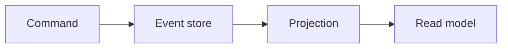

# CQRS and Event Sourcing

## Why it matters
Separating reads and writes can improve scalability and auditability.

## Progression checkpoints
| Level | Focus |
| --- | --- |
| Beginner | Understand command vs query separation. |
| Intermediate | Model read and write stores. |
| Senior | Apply event sourcing for audit trails. |
| Principal | Decide when CQRS is worth the complexity. |

## Key concepts
- CQRS: separate read and write models.
- Event sourcing and append-only logs.
- Projections and read models.
- Rebuild and replay strategies.

## Real-world example: Audit trail
A finance system stores all account changes as events and builds balances from
projections.

## Diagram

## Practical checklist
- Use CQRS when read/write needs differ significantly.
- Ensure event schemas are versioned.
- Plan for event replay and backfill.
