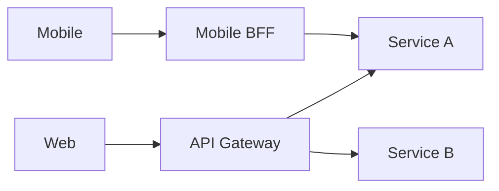

# Gateways, BFF, and Service Mesh

## Why it matters
Gateways and meshes manage cross-cutting concerns like routing, auth, and
observability.

## Progression checkpoints
| Level | Focus |
| --- | --- |
| Beginner | Know what an API gateway does. |
| Intermediate | Use BFFs for client-specific needs. |
| Senior | Apply service mesh for traffic management. |
| Principal | Standardize edge and mesh policies. |

## Key concepts
- API gateway vs reverse proxy.
- Backend-for-frontend (BFF) pattern.
- Service mesh sidecars and policies.
- Centralized auth, rate limiting, and tracing.

## Real-world example: Mobile and web clients
A mobile app uses a BFF to aggregate data and reduce round trips.

## Diagram

## Practical checklist
- Keep gateway logic thin and focused.
- Use BFFs to tailor responses per client.
- Ensure mesh policies are versioned and tested.
