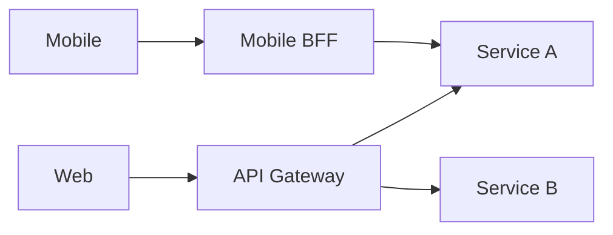

# Gateways, BFF, and Service Mesh

## Why it matters
Gateways and meshes manage cross-cutting concerns like routing, auth, and
observability.

## Progression checkpoints
| Level | Focus |
| --- | --- |
| Beginner | Know what an API gateway does. |
| Intermediate | Use BFFs for client-specific needs. |
| Senior | Apply service mesh for traffic management. |
| Principal | Standardize edge and mesh policies. |

## Key concepts
- API gateway vs reverse proxy.
- Backend-for-frontend (BFF) pattern.
- Service mesh sidecars and policies.
- Centralized auth, rate limiting, and tracing.

## Detailed explanation
- **API gateways** handle auth, rate limits, and routing at the edge.
- **BFFs** tailor responses for specific clients to reduce chattiness.
- **Service meshes** manage service-to-service traffic with policies and
  telemetry via sidecars.
- **Cross-cutting policies** should be versioned to avoid breaking clients.

## Real-world example: Mobile and web clients
A mobile app uses a BFF to aggregate data and reduce round trips.

## Diagram

## Additional real-world examples
- Gateway enforces JWT validation and attaches user context headers.
- Mesh policy enables mTLS for all internal traffic without app changes.
- BFF aggregates profile, orders, and recommendations for a single mobile call.

## Practical checklist
- Keep gateway logic thin and focused.
- Use BFFs to tailor responses per client.
- Ensure mesh policies are versioned and tested.

## Official documentation
- https://docs.aws.amazon.com/apigateway/
- https://www.envoyproxy.io/docs/envoy/latest/
- https://istio.io/latest/docs/
