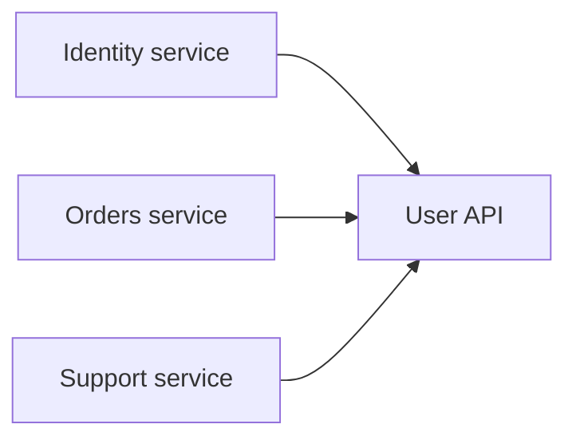

# Data Ownership and Boundaries

## Why it matters
Clear ownership prevents data coupling and conflicting changes.

## Progression checkpoints
| Level | Focus |
| --- | --- |
| Beginner | Understand data ownership. |
| Intermediate | Avoid shared databases across services. |
| Senior | Define contracts for shared data. |
| Principal | Enforce ownership and governance. |

## Key concepts
- Single source of truth per domain.
- Service boundaries and contracts.
- Data duplication vs shared tables.
- Ownership and stewardship.

## Real-world example: User profile ownership
The identity service owns user data; other services consume via API or events.

## Diagram

## Practical checklist
- Avoid direct database access across services.
- Use events or APIs for data sharing.
- Document ownership in system diagrams.
