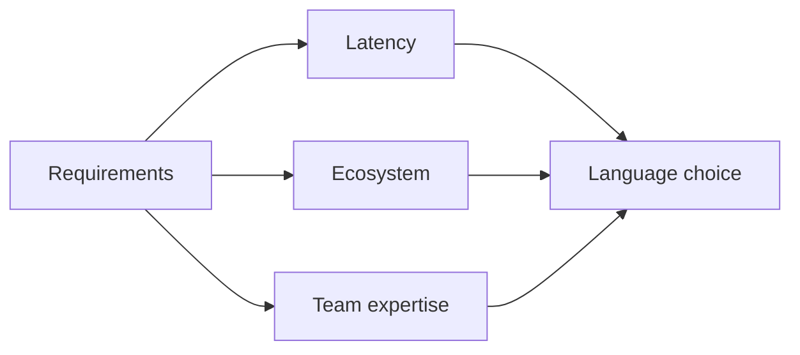

# Language and Runtime Selection

## Why it matters
Language choice affects performance, hiring, tooling, and reliability.

## Progression checkpoints
| Level | Focus |
| --- | --- |
| Beginner | Understand basic runtime differences. |
| Intermediate | Compare ecosystems and libraries. |
| Senior | Evaluate performance and operational behavior. |
| Principal | Set approved stacks and migration paths. |

## Key concepts
- Performance characteristics and latency.
- Ecosystem maturity and library support.
- Hiring and team expertise.
- Runtime behavior (GC, memory, startup time).

## Real-world example: Low-latency service
A real-time bidding service selects Go for predictable latency and low memory
overhead compared to a dynamic runtime.

## Diagram

## Practical checklist
- Match runtime to workload characteristics.
- Prefer common stacks for easier hiring.
- Document tradeoffs for future teams.
