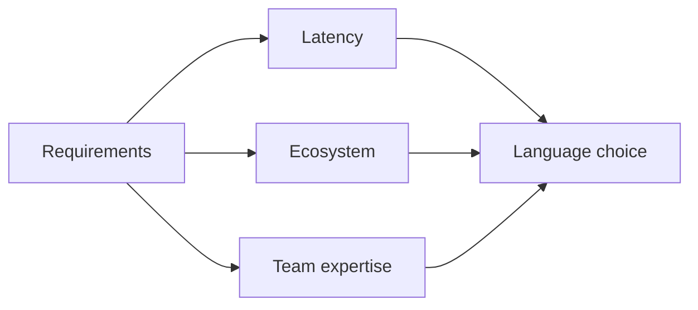

# Language and Runtime Selection

## Why it matters
Language choice affects performance, hiring, tooling, and reliability.

## Progression checkpoints
| Level | Focus |
| --- | --- |
| Beginner | Understand basic runtime differences. |
| Intermediate | Compare ecosystems and libraries. |
| Senior | Evaluate performance and operational behavior. |
| Principal | Set approved stacks and migration paths. |

## Key concepts
- Performance characteristics and latency.
- Ecosystem maturity and library support.
- Hiring and team expertise.
- Runtime behavior (GC, memory, startup time).

## Detailed explanation
- **Performance** affects tail latency and cost at scale; benchmark with real
  workloads rather than microbenchmarks.
- **Ecosystem maturity** influences library quality, security updates, and
  tooling support.
- **Team expertise** reduces ramp-up time and operational mistakes.
- **Runtime behavior** (GC pauses, JIT warmup, startup time) matters for
  autoscaling and cold starts.

## Real-world example: Low-latency service
A real-time bidding service selects Go for predictable latency and low memory
overhead compared to a dynamic runtime.

## Diagram

## Additional real-world examples
- Serverless workloads choose a fast-starting runtime to reduce cold-starts.
- Data pipelines pick JVM for mature big-data libraries and tooling.
- Latency-critical gateway uses Rust for predictable performance.

## Practical checklist
- Match runtime to workload characteristics.
- Prefer common stacks for easier hiring.
- Document tradeoffs for future teams.

## Official documentation
- https://go.dev/doc/
- https://docs.oracle.com/javase/17/
- https://nodejs.org/en/docs
