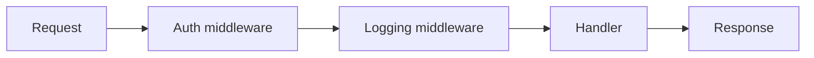

# Web Frameworks and Middleware

## Why it matters
Frameworks define routing, middleware, and request lifecycles. Good choices
improve speed and consistency.

## Progression checkpoints
| Level | Focus |
| --- | --- |
| Beginner | Use routing and handlers. |
| Intermediate | Build middleware pipelines. |
| Senior | Standardize request/response handling. |
| Principal | Select frameworks for long-term support. |

## Key concepts
- Routing and handler lifecycle.
- Middleware for auth, logging, and validation.
- Dependency injection and lifecycle hooks.

## Detailed explanation
- **Routing** defines how requests map to handlers; consistent patterns reduce
  surprises for clients.
- **Middleware** centralizes cross-cutting concerns like auth and logging.
- **Lifecycle hooks** allow initialization and teardown for resources like DB
  connections.

## Real-world example: Auth middleware
A service validates JWTs in middleware before routing requests.

## Diagram

## Additional real-world examples
- Middleware injects request IDs into logs for correlation.
- Rate limiting enforced at the framework layer before handler execution.
- Global error handler maps exceptions to consistent API responses.

## Practical checklist
- Keep middleware focused and small.
- Avoid hidden side effects in middleware.
- Standardize error handling in the framework.

## Official documentation
- https://expressjs.com/en/guide/using-middleware.html
- https://docs.djangoproject.com/en/stable/topics/http/middleware/
- https://docs.spring.io/spring-boot/docs/current/reference/html/web.html
