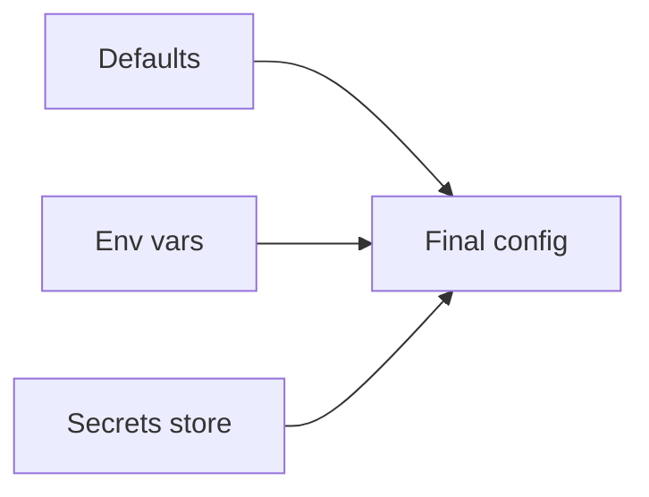

# Configuration and Environment

## Why it matters
Misconfiguration is a common cause of outages. Clear configuration strategies
reduce risk.

## Progression checkpoints
| Level | Focus |
| --- | --- |
| Beginner | Use environment variables. |
| Intermediate | Validate configuration at startup. |
| Senior | Manage secrets and config per environment. |
| Principal | Define org-wide config standards. |

## Key concepts
- Configuration precedence and defaults.
- Secrets management and rotation.
- Environment-specific overrides.

## Detailed explanation
- **Precedence** avoids ambiguity; define a clear order (flags > env > file).
- **Secrets** should live in dedicated stores with rotation policies.
- **Environment overrides** enable safe testing without changing code.

## Real-world example: Feature flag config
A service loads feature flags from config, with safe defaults for production.

## Diagram

## Additional real-world examples
- Staging uses lower rate limits via env overrides.
- Secrets rotated monthly with automatic reload in the app.
- Config validation prevents boot when required values are missing.

## Practical checklist
- Validate required configs on startup.
- Avoid secrets in plain text files.
- Document each config key and owner.

## Official documentation
- https://kubernetes.io/docs/concepts/configuration/
- https://developer.hashicorp.com/vault/docs
