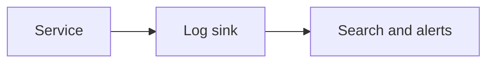

# Logging and Runtime Diagnostics

## Why it matters
Logs and runtime diagnostics are essential for debugging production issues.

## Progression checkpoints
| Level | Focus |
| --- | --- |
| Beginner | Use structured logging basics. |
| Intermediate | Add correlation IDs and log levels. |
| Senior | Standardize logging across services. |
| Principal | Define retention and privacy rules. |

## Key concepts
- Structured logs and JSON output.
- Log levels and sampling.
- Correlation IDs and tracing fields.

## Real-world example: Payment tracing
A payment request logs a correlation ID that appears in every downstream log.

## Diagram

## Practical checklist
- Log one line per event with key fields.
- Avoid logging PII or secrets.
- Keep log formats consistent across services.
