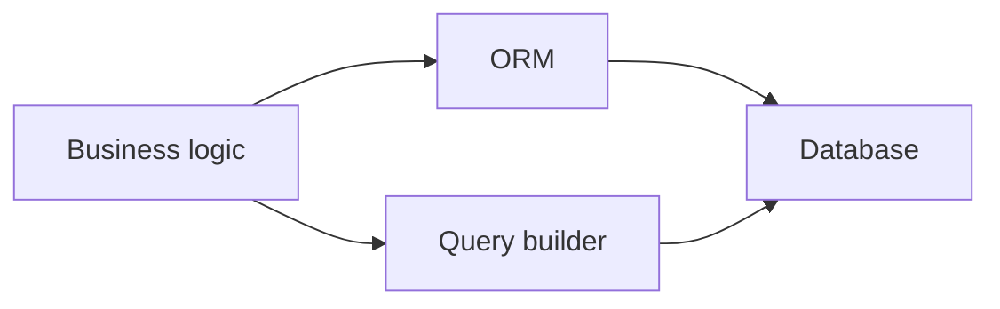

# Data Access: ORM vs Query Builder

## Why it matters
Data access patterns affect performance and developer productivity.

## Progression checkpoints
| Level | Focus |
| --- | --- |
| Beginner | Use ORM for CRUD operations. |
| Intermediate | Understand query builders and raw SQL. |
| Senior | Optimize complex queries and avoid N+1. |
| Principal | Set standards for data access patterns. |

## Key concepts
- ORM abstractions and limitations.
- Query builders for complex queries.
- Migration tooling and schema changes.

## Real-world example: Reporting query
A report needs a complex join and aggregation; the team uses a query builder to
avoid ORM limitations.

## Diagram

## Practical checklist
- Use ORM for standard CRUD.
- Drop to SQL for complex analytics.
- Benchmark queries before shipping.
