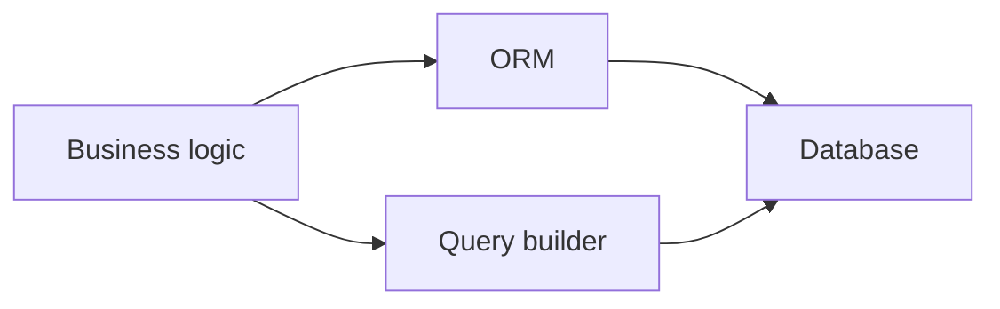

# Data Access: ORM vs Query Builder

## Why it matters
Data access patterns affect performance and developer productivity.

## Progression checkpoints
| Level | Focus |
| --- | --- |
| Beginner | Use ORM for CRUD operations. |
| Intermediate | Understand query builders and raw SQL. |
| Senior | Optimize complex queries and avoid N+1. |
| Principal | Set standards for data access patterns. |

## Key concepts
- ORM abstractions and limitations.
- Query builders for complex queries.
- Migration tooling and schema changes.

## Detailed explanation
- **ORMs** speed up CRUD but can hide inefficient queries.
- **Query builders** provide control over joins and indexes while still being
  safer than raw SQL string concatenation.
- **Migrations** should be managed consistently across services and
  environments.

## Real-world example: Reporting query
A report needs a complex join and aggregation; the team uses a query builder to
avoid ORM limitations.

## Diagram

## Additional real-world examples
- ORM used for standard inserts, but reporting uses raw SQL for performance.
- Query builder enforces safe parameter binding to avoid SQL injection.
- N+1 queries detected in ORM logs and fixed with eager loading.

## Practical checklist
- Use ORM for standard CRUD.
- Drop to SQL for complex analytics.
- Benchmark queries before shipping.

## Official documentation
- https://docs.sqlalchemy.org/
- https://hibernate.org/orm/documentation/
- https://knexjs.org/guide/
