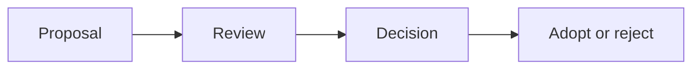

# Stack Evaluation and Governance

## Why it matters
Consistent stack choices reduce operational risk and improve maintainability.

## Progression checkpoints
| Level | Focus |
| --- | --- |
| Beginner | Learn why standards exist. |
| Intermediate | Evaluate tradeoffs for a service. |
| Senior | Propose changes with evidence. |
| Principal | Define standards, reviews, and exceptions. |

## Key concepts
- Decision criteria: performance, cost, maintainability.
- Upgrade cadence and deprecation policies.
- Exception process and risk review.

## Real-world example: New framework proposal
A team proposes a new framework and documents risks, maintenance cost, and a
support plan before approval.

## Diagram

## Practical checklist
- Require evidence for new tech adoption.
- Document ownership and support plans.
- Revisit decisions on a fixed cadence.
