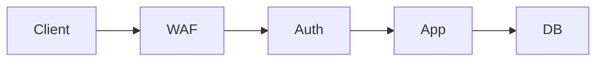

# Security Principles

## Why it matters
Security principles guide design decisions and reduce risk across services.

## Progression checkpoints
| Level | Focus |
| --- | --- |
| Beginner | Learn least privilege and secure defaults. |
| Intermediate | Apply defense in depth. |
| Senior | Balance security with usability. |
| Principal | Define baseline security standards. |

## Key concepts
- Least privilege.
- Defense in depth.
- Secure defaults.
- Fail closed vs fail open.

## Detailed explanation
- **Least privilege** reduces blast radius if a component is compromised.
- **Defense in depth** layers controls so a single failure is not catastrophic.
- **Secure defaults** prevent misconfiguration from exposing systems.
- **Fail closed** is safer for security-critical paths, while fail open may be
  acceptable for non-critical features.

## Real-world example: Database access
An app uses a read-only DB role for analytics queries to prevent data changes.

## Diagram

## Additional real-world examples
- Admin routes protected by separate auth and network allowlists.
- Feature flags default to "off" in production to avoid accidental exposure.
- Read-only credentials used for analytics dashboards.

## Practical checklist
- Use least privilege for every component.
- Apply layered controls across the stack.
- Assume the network is hostile.

## Official documentation
- https://www.nist.gov/cyberframework
- https://csrc.nist.gov/publications/detail/sp/800-53/rev-5/final
