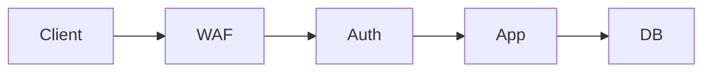

# Security Principles

## Why it matters
Security principles guide design decisions and reduce risk across services.

## Progression checkpoints
| Level | Focus |
| --- | --- |
| Beginner | Learn least privilege and secure defaults. |
| Intermediate | Apply defense in depth. |
| Senior | Balance security with usability. |
| Principal | Define baseline security standards. |

## Key concepts
- Least privilege.
- Defense in depth.
- Secure defaults.
- Fail closed vs fail open.

## Real-world example: Database access
An app uses a read-only DB role for analytics queries to prevent data changes.

## Diagram

## Practical checklist
- Use least privilege for every component.
- Apply layered controls across the stack.
- Assume the network is hostile.
