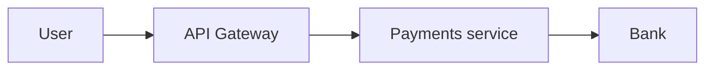

# Threat Modeling

## Why it matters
Threat modeling identifies risks early and prioritizes mitigation work.

## Progression checkpoints
| Level | Focus |
| --- | --- |
| Beginner | Identify assets and entry points. |
| Intermediate | Use STRIDE or similar frameworks. |
| Senior | Prioritize risks and mitigations. |
| Principal | Make threat modeling a standard practice. |

## Key concepts
- Assets, threats, and attack surfaces.
- STRIDE categories.
- Risk impact and likelihood.

## Detailed explanation
- **Assets and entry points** clarify what needs protection and where attacks
  can occur.
- **STRIDE** helps categorize threats and avoid blind spots.
- **Risk scoring** balances impact vs likelihood to prioritize mitigation work.

## Real-world example: Payment API
The team models threats like credential stuffing and replay attacks.

## Diagram

## Additional real-world examples
- Replay attacks mitigated with idempotency keys and nonce checks.
- Credential stuffing reduced with MFA and rate limiting.
- Threat model updated after adding a new webhook integration.

## Practical checklist
- Document assets and critical flows.
- Identify trust boundaries.
- Track mitigations and owners.

## Official documentation
- https://learn.microsoft.com/en-us/azure/security/develop/threat-modeling-tool
- https://www.owasp.org/www-community/Threat_Modeling
