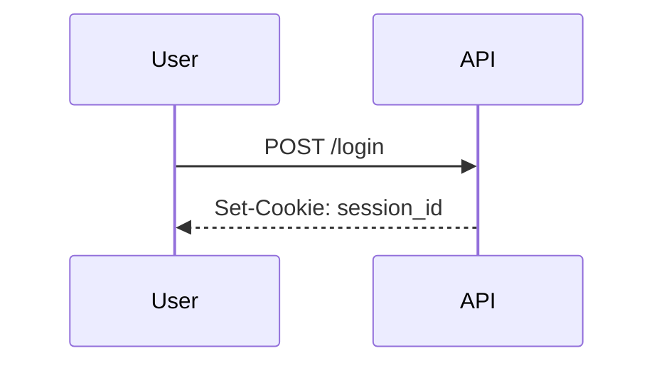

# Authentication Basics

## Why it matters
Authentication verifies identity. Weak auth leads to account takeovers.

## Progression checkpoints
| Level | Focus |
| --- | --- |
| Beginner | Password hashing and login flow. |
| Intermediate | Sessions vs tokens. |
| Senior | Multi-factor auth and secure sessions. |
| Principal | Define auth standards and lifecycle rules. |

## Key concepts
- Password hashing with salt (bcrypt, scrypt, argon2).
- Sessions and cookies.
- JWTs and token validation.
- MFA and account recovery.

## Real-world example: Login session
User logs in, server stores a session and issues a secure cookie.

## Diagram

## Practical checklist
- Never store plain passwords.
- Secure cookies with HttpOnly and SameSite.
- Rotate and expire sessions.
