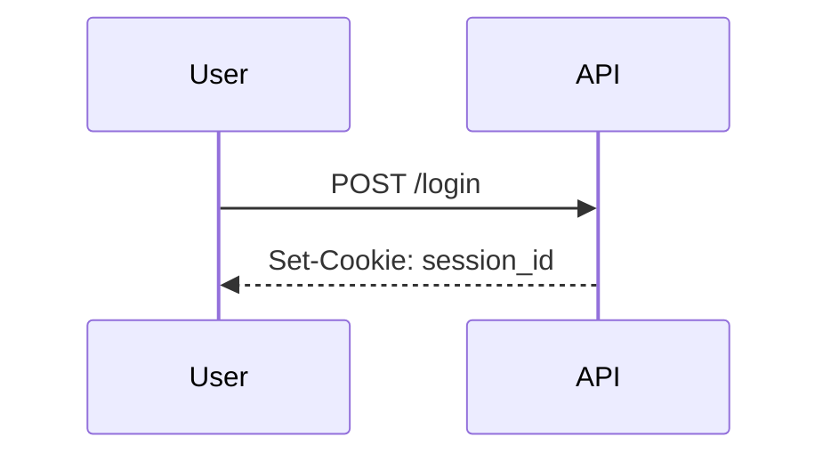

# Authentication Basics

## Why it matters
Authentication verifies identity. Weak auth leads to account takeovers.

## Progression checkpoints
| Level | Focus |
| --- | --- |
| Beginner | Password hashing and login flow. |
| Intermediate | Sessions vs tokens. |
| Senior | Multi-factor auth and secure sessions. |
| Principal | Define auth standards and lifecycle rules. |

## Key concepts
- Password hashing with salt (bcrypt, scrypt, argon2).
- Sessions and cookies.
- JWTs and token validation.
- MFA and account recovery.

## Detailed explanation
- **Password hashing** should use modern algorithms with salt and cost factors.
- **Sessions** are server-side state; secure cookies protect session IDs.
- **JWTs** require signature and claim validation (issuer, audience, expiry).
- **MFA** reduces account takeover risk and should be easy to recover safely.

## Real-world example: Login session
User logs in, server stores a session and issues a secure cookie.

## Diagram

## Additional real-world examples
- Password reset tokens expire quickly and are single-use.
- Session rotation after login prevents fixation attacks.
- MFA enforced for high-risk actions like changing payout accounts.

## Practical checklist
- Never store plain passwords.
- Secure cookies with HttpOnly and SameSite.
- Rotate and expire sessions.

## Official documentation
- https://csrc.nist.gov/publications/detail/sp/800-63b/final
- https://www.rfc-editor.org/rfc/rfc9106
