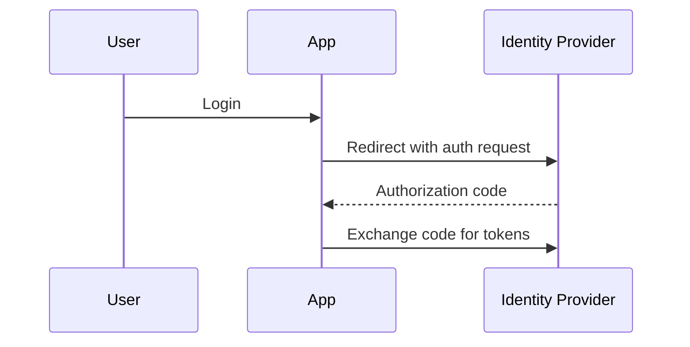

# OAuth2 and OIDC

## Why it matters
OAuth2 and OIDC enable delegated authorization and single sign-on.

## Progression checkpoints
| Level | Focus |
| --- | --- |
| Beginner | Understand authorization code flow. |
| Intermediate | Use PKCE for public clients. |
| Senior | Secure refresh tokens and scopes. |
| Principal | Define SSO and identity provider standards. |

## Key concepts
- OAuth2 roles: client, resource owner, auth server.
- Authorization code flow and PKCE.
- OIDC ID tokens and user identity claims.
- Scopes and consent.

## Detailed explanation
- **Authorization code flow** is the standard for web and mobile apps.
- **PKCE** protects public clients from code interception attacks.
- **OIDC** adds identity claims and standardized user info on top of OAuth2.
- **Scopes and consent** should be minimal and clearly explained to users.

## Real-world example: Google login
A web app uses OAuth2 to authenticate users via Google.

## Diagram

## Additional real-world examples
- Refresh tokens stored in secure, HttpOnly cookies with rotation.
- Mobile app uses PKCE with custom scheme redirect URIs.
- Access tokens scoped to `read:orders` instead of broad access.

## Practical checklist
- Use PKCE for public clients.
- Rotate and secure refresh tokens.
- Validate issuer and audience claims.

## Official documentation
- https://www.rfc-editor.org/rfc/rfc6749
- https://www.rfc-editor.org/rfc/rfc7636
- https://openid.net/specs/openid-connect-core-1_0.html
