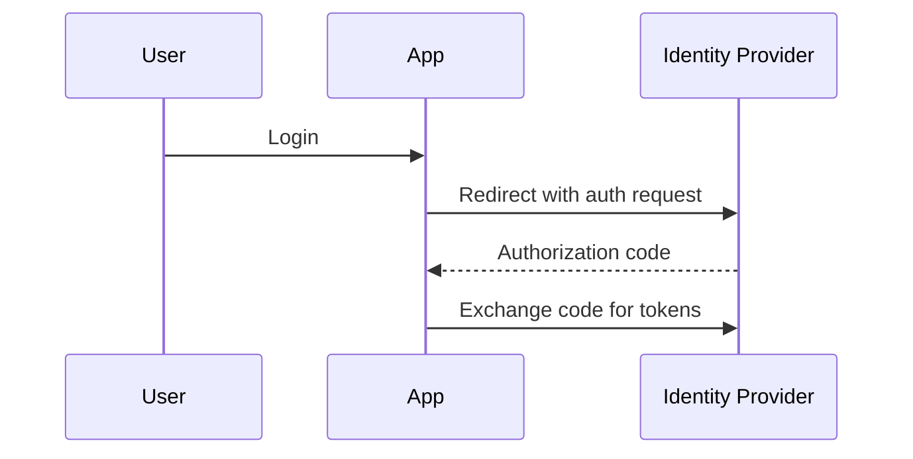

# OAuth2 and OIDC

## Why it matters
OAuth2 and OIDC enable delegated authorization and single sign-on.

## Progression checkpoints
| Level | Focus |
| --- | --- |
| Beginner | Understand authorization code flow. |
| Intermediate | Use PKCE for public clients. |
| Senior | Secure refresh tokens and scopes. |
| Principal | Define SSO and identity provider standards. |

## Key concepts
- OAuth2 roles: client, resource owner, auth server.
- Authorization code flow and PKCE.
- OIDC ID tokens and user identity claims.
- Scopes and consent.

## Real-world example: Google login
A web app uses OAuth2 to authenticate users via Google.

## Diagram

## Practical checklist
- Use PKCE for public clients.
- Rotate and secure refresh tokens.
- Validate issuer and audience claims.
