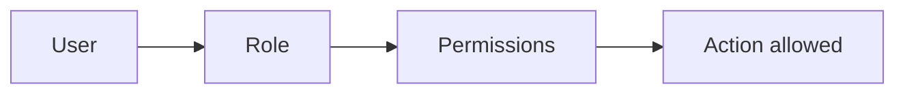

# Authorization Models

## Why it matters
Authorization controls access to sensitive data and actions.

## Progression checkpoints
| Level | Focus |
| --- | --- |
| Beginner | Use simple role checks. |
| Intermediate | Implement RBAC and ABAC. |
| Senior | Model permissions for complex domains. |
| Principal | Define authorization standards and audits. |

## Key concepts
- RBAC (role-based access control).
- ABAC (attribute-based access control).
- Policy evaluation and enforcement points.

## Real-world example: Admin actions
Only users with the `admin` role can disable accounts.

## Diagram

## Practical checklist
- Centralize authorization logic.
- Log access decisions for audit trails.
- Keep permissions granular and explicit.
