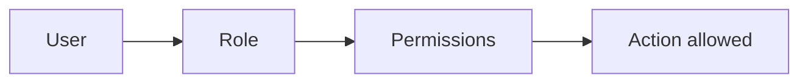

# Authorization Models

## Why it matters
Authorization controls access to sensitive data and actions.

## Progression checkpoints
| Level | Focus |
| --- | --- |
| Beginner | Use simple role checks. |
| Intermediate | Implement RBAC and ABAC. |
| Senior | Model permissions for complex domains. |
| Principal | Define authorization standards and audits. |

## Key concepts
- RBAC (role-based access control).
- ABAC (attribute-based access control).
- Policy evaluation and enforcement points.

## Detailed explanation
- **RBAC** is easy to manage but can become coarse for large systems.
- **ABAC** supports fine-grained decisions using attributes like tenant or
  region.
- **Policy enforcement points** should be centralized to avoid drift.

## Real-world example: Admin actions
Only users with the `admin` role can disable accounts.

## Diagram

## Additional real-world examples
- Customer support role can read tickets but cannot refund payments.
- ABAC uses tenant ID and environment to restrict access.
- Permission changes audited and reviewed quarterly.

## Practical checklist
- Centralize authorization logic.
- Log access decisions for audit trails.
- Keep permissions granular and explicit.

## Official documentation
- https://csrc.nist.gov/projects/attribute-based-access-control
