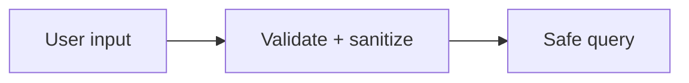

# Input Validation and OWASP Risks

## Why it matters
Most breaches exploit poor validation and unsafe defaults.

## Progression checkpoints
| Level | Focus |
| --- | --- |
| Beginner | Validate and sanitize input. |
| Intermediate | Understand common OWASP risks. |
| Senior | Build defense-in-depth controls. |
| Principal | Define secure coding standards. |

## Key concepts
- Input validation and output encoding.
- SQL injection, XSS, CSRF, SSRF.
- Use of prepared statements and escaping.

## Real-world example: SQL injection prevention
Use parameterized queries instead of string concatenation.

## Diagram

## Practical checklist
- Validate input on every boundary.
- Use parameterized queries.
- Apply CSRF protection for browser flows.
