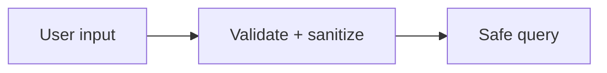

# Input Validation and OWASP Risks

## Why it matters
Most breaches exploit poor validation and unsafe defaults.

## Progression checkpoints
| Level | Focus |
| --- | --- |
| Beginner | Validate and sanitize input. |
| Intermediate | Understand common OWASP risks. |
| Senior | Build defense-in-depth controls. |
| Principal | Define secure coding standards. |

## Key concepts
- Input validation and output encoding.
- SQL injection, XSS, CSRF, SSRF.
- Use of prepared statements and escaping.

## Detailed explanation
- **Validation** should occur at every boundary and reject unexpected fields.
- **Output encoding** prevents XSS by escaping untrusted data in templates.
- **Prepared statements** separate code from data to block SQL injection.

## Real-world example: SQL injection prevention
Use parameterized queries instead of string concatenation.

## Diagram

## Additional real-world examples
- SSRF prevented by allowlisting outbound domains for webhook fetches.
- CSRF tokens required for browser-based form submissions.
- Input size limits prevent memory exhaustion attacks.

## Practical checklist
- Validate input on every boundary.
- Use parameterized queries.
- Apply CSRF protection for browser flows.

## Official documentation
- https://owasp.org/Top10/
- https://cwe.mitre.org/top25/archive/2023/2023_cwe_top25.html
