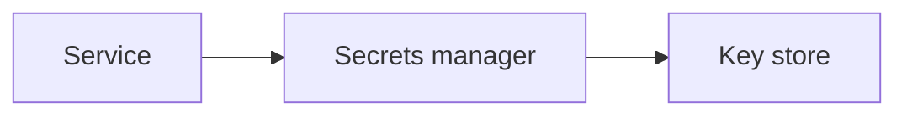

# Secrets and Encryption

## Why it matters
Secrets and encryption protect sensitive data at rest and in transit.

## Progression checkpoints
| Level | Focus |
| --- | --- |
| Beginner | Use TLS and basic secret storage. |
| Intermediate | Manage key rotation and access control. |
| Senior | Encrypt data at rest with KMS. |
| Principal | Define key management and compliance policies. |

## Key concepts
- TLS in transit and encryption at rest.
- Secrets managers and access control.
- Key rotation and revocation.

## Real-world example: API key rotation
A service stores API keys in a secrets manager and rotates them monthly.

## Diagram

## Practical checklist
- Never hardcode secrets.
- Rotate keys and revoke compromised ones.
- Encrypt backups and snapshots.
