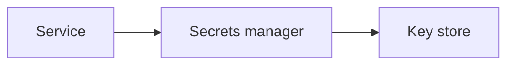

# Secrets and Encryption

## Why it matters
Secrets and encryption protect sensitive data at rest and in transit.

## Progression checkpoints
| Level | Focus |
| --- | --- |
| Beginner | Use TLS and basic secret storage. |
| Intermediate | Manage key rotation and access control. |
| Senior | Encrypt data at rest with KMS. |
| Principal | Define key management and compliance policies. |

## Key concepts
- TLS in transit and encryption at rest.
- Secrets managers and access control.
- Key rotation and revocation.

## Detailed explanation
- **TLS** protects data in transit; enforce modern versions and strong ciphers.
- **Secrets managers** provide access control, auditing, and rotation.
- **Key rotation** limits exposure and supports rapid revocation.

## Real-world example: API key rotation
A service stores API keys in a secrets manager and rotates them monthly.

## Diagram

## Additional real-world examples
- Database credentials rotated automatically with short-lived leases.
- Envelope encryption used to protect large datasets with KMS-managed keys.
- Secrets injected at runtime instead of baked into images.

## Practical checklist
- Never hardcode secrets.
- Rotate keys and revoke compromised ones.
- Encrypt backups and snapshots.

## Official documentation
- https://www.rfc-editor.org/rfc/rfc8446
- https://docs.aws.amazon.com/kms/latest/developerguide/overview.html
