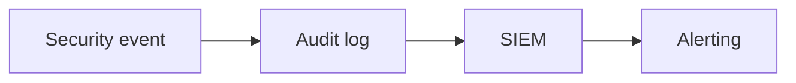

# Audit Logging and Monitoring

## Why it matters
Audit logs provide accountability and support investigations.

## Progression checkpoints
| Level | Focus |
| --- | --- |
| Beginner | Log security-relevant events. |
| Intermediate | Centralize audit logs. |
| Senior | Monitor for suspicious patterns. |
| Principal | Define audit and retention policies. |

## Key concepts
- Audit trails for sensitive actions.
- Immutable logging and retention.
- Alerts for anomalous activity.

## Detailed explanation
- **Audit trails** capture who did what and when for sensitive actions.
- **Immutable logging** prevents tampering and supports compliance reviews.
- **Alerting** detects suspicious patterns like unusual access or privilege
  escalations.

## Real-world example: Admin actions
Every role change and account deletion is logged with who, what, and when.

## Diagram

## Additional real-world examples
- Admin privilege changes trigger immediate security alerts.
- Audit logs stored in write-once object storage for retention.
- Quarterly audit reviews validate access patterns for compliance.

## Practical checklist
- Log actor, action, and target.
- Protect audit logs from deletion.
- Review audit events regularly.

## Official documentation
- https://csrc.nist.gov/publications/detail/sp/800-92/final
