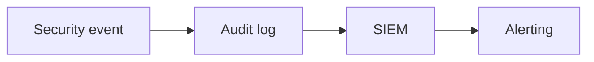

# Audit Logging and Monitoring

## Why it matters
Audit logs provide accountability and support investigations.

## Progression checkpoints
| Level | Focus |
| --- | --- |
| Beginner | Log security-relevant events. |
| Intermediate | Centralize audit logs. |
| Senior | Monitor for suspicious patterns. |
| Principal | Define audit and retention policies. |

## Key concepts
- Audit trails for sensitive actions.
- Immutable logging and retention.
- Alerts for anomalous activity.

## Real-world example: Admin actions
Every role change and account deletion is logged with who, what, and when.

## Diagram

## Practical checklist
- Log actor, action, and target.
- Protect audit logs from deletion.
- Review audit events regularly.
