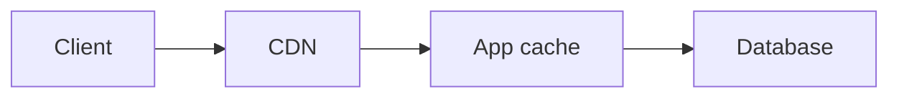

# Cache Layers

## Why it matters
Caching at the right layer reduces latency and database load.

## Progression checkpoints
| Level | Focus |
| --- | --- |
| Beginner | Understand cache layers. |
| Intermediate | Pick cache location per use case. |
| Senior | Combine layers for resilience. |
| Principal | Standardize cache hierarchies. |

## Key concepts
- Client, CDN, edge, app, and database caching.
- Cache locality and data freshness.
- Read vs write heavy workloads.

## Real-world example: Product catalog
A catalog uses CDN for images, app cache for product details, and DB cache for
hot queries.

## Diagram

## Practical checklist
- Cache static assets at the edge.
- Cache hot reads in the application tier.
- Ensure cache layers have clear ownership.
