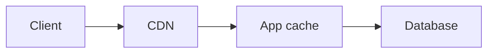

# Cache Layers

## Why it matters
Caching at the right layer reduces latency and database load.

## Progression checkpoints
| Level | Focus |
| --- | --- |
| Beginner | Understand cache layers. |
| Intermediate | Pick cache location per use case. |
| Senior | Combine layers for resilience. |
| Principal | Standardize cache hierarchies. |

## Key concepts
- Client, CDN, edge, app, and database caching.
- Cache locality and data freshness.
- Read vs write heavy workloads.

## Detailed explanation
- **Edge and CDN caches** reduce round trips and protect origins.
- **Application caches** store hot data close to compute for fast access.
- **Database caches** (buffer pools) reduce disk reads for hot datasets.
- **Freshness** needs clear TTLs and invalidation ownership per layer.

## Real-world example: Product catalog
A catalog uses CDN for images, app cache for product details, and DB cache for
hot queries.

## Diagram

## Additional real-world examples
- Product images cached at CDN while personalized pricing stays in app cache.
- Mobile app caches static config locally to reduce cold start latency.
- Edge cache used for public landing pages to absorb traffic spikes.

## Practical checklist
- Cache static assets at the edge.
- Cache hot reads in the application tier.
- Ensure cache layers have clear ownership.

## Official documentation
- https://redis.io/docs/
- https://www.rfc-editor.org/rfc/rfc9111
