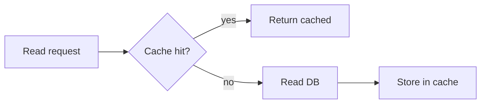

# Caching Strategies

## Why it matters
Strategy selection controls consistency, latency, and write amplification.

## Progression checkpoints
| Level | Focus |
| --- | --- |
| Beginner | Use cache-aside for reads. |
| Intermediate | Apply write-through and write-back. |
| Senior | Choose strategy per data type. |
| Principal | Define strategy defaults and exceptions. |

## Key concepts
- Cache-aside (lazy loading).
- Write-through vs write-back.
- TTL and refresh policies.

## Detailed explanation
- **Cache-aside** loads data on misses and keeps cache close to read patterns.
- **Write-through** keeps cache and DB consistent but adds write latency.
- **Write-back** improves write latency but risks data loss on cache failure.
- **TTL policies** balance freshness with hit rate.

## Real-world example: User profiles
User reads use cache-aside; writes update DB first and invalidate cache.

## Diagram

## Additional real-world examples
- User profile writes update DB then invalidate cache for read-your-writes.
- Aggregated metrics cached with short TTL to reduce recompute cost.
- Write-through used for session data to avoid stale reads.

## Practical checklist
- Use cache-aside for most read-heavy data.
- Document consistency expectations per strategy.
- Avoid write-back unless you can tolerate data loss.

## Official documentation
- https://learn.microsoft.com/en-us/azure/architecture/patterns/cache-aside
